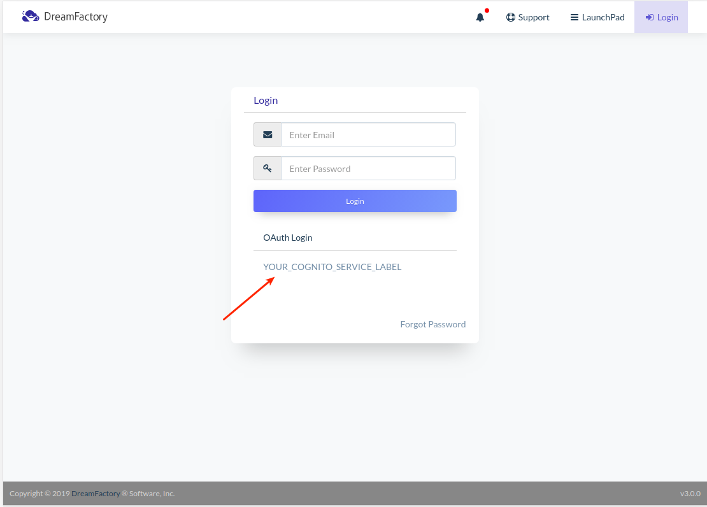

Hi all!

**Here are a step-by-step tutorial, which explains how to integrate Cognito User Pools with DreamFactory via OpenID service.**

You can find a script which I used within the tutorial in this GitHub repository:
[df-int-cognito-openid](https://github.com/dreamfactorysoftware/df-int-cognito-openid)

So, let's start!

**NOTE:** If you face with CORS problem, check DreamFactory [CORS configuration](#and-dont-forget-add-your-application-and-cognito-to-dreamfactory--config--cors) section in the end of this README.md

Before we start, you should already have Cognito User Pool. 

#### Here are some steps to get it

1. Create an account on **AWS** (if not exist yet) and sign in.
2. Go to **Cognito** service


3. Create new **User Pool** if it doesn't exist yet
4. Choose one of your **Users Pools**

So, now you should see something like this:


## DreamFactory configuration

1. Sign-in into your DreamFactory admin app
2. Create new **OpenID Connect** service


3.  Fill in the **Info** tab


4. Configure the **Config** tab
- Choose a role for users
- Paste path to your **Discovery Document Endpoint**. This endpoint is available from `https://cognito-idp.{REGION}.amazonaws.com/{USER_POOL_ID}`.
- Paste your **Client ID** and **Client Secret**


- **Redirect URL** - endpoint, which process response from Cognito. I wrote a little PHP script because of these reasons and hosted it with Apache on my localhost. Probably, you will paste your application's endpoint instead of this script.

```php
<?php

    // script located here -> /var/www/cognito_oauth.php
    if( $_GET["code"] ) {
        echo "Your code is: " . $_GET['code'] . "<br />";
    }

    $url = "{YOUR_COGNITO_URL}/oauth2/token";
    // $redirect_url should be he same as Redirect URL from Config tab on DreamFactory
    $redirect_url = 'http://localhost/cognito_oauth.php';
    $client_key = "{Client ID}";
    $client_secret = "{Client Secret}";
    $data = [
        'grant_type' => 'authorization_code',
        'client_id'=>$client_key,
        'code'=>$_GET['code'],
        'redirect_uri'=>$redirect_url
    ];
    $field_string = http_build_query($data);

    if($_GET["code"]) {

        $handle = curl_init($url);
        curl_setopt($handle, CURLOPT_VERBOSE, true);
        curl_setopt($handle, CURLOPT_FOLLOWLOCATION, true);
        curl_setopt($handle, CURLOPT_USERPWD, $client_key . ":" . $client_secret);
        curl_setopt($handle, CURLOPT_RETURNTRANSFER, true);
        curl_setopt($handle, CURLOPT_POSTFIELDS, $field_string);
        $resp = json_decode(curl_exec($handle),true);
        print('<pre>');
        print_r($resp);
        print('<pre>');

        curl_close($handle);
    }

?>

```


- Click **Save and close** button. Fields like **User Info endpoint**, **Token endpoint** will be filled in automatically.

Also, you should change **Callback URL** on Cognito to **Redirect URL** from **Config** tab.


And also please note that there are different **OAuth Flows**, but I used **Authorization code grant** option.


## What should be the workflow?

1. Just go to `/api/v2/user/session?service=YOUR_COGNITO_SERVICE_NAME` endpoint. This endpoint should generate a request to Cognito. The button from DreamFactory the sign-in form also does this.



2. Then users will be redirected to the Cognito sign-in form.


3. After entering credentials, users will be redirected to **Redirect URL** (**Callback URL**) which you specified earlier. In my case, it is just a PHP script (**cognito_oauth.php**). This script takes **code** from URL (this **code** is attached by Cognito) and does request to Cognito. As a response, Cognito sends back **tokens**, which we can use for communication with Cognito.


#### Some useful links:

- https://docs.aws.amazon.com/cognito/latest/developerguide/cognito-userpools-server-contract-reference.html
- https://medium.com/@robert.broeckelmann/openid-connect-authorization-code-flow-with-aws-cognito-246997abd11a
- https://docs.aws.amazon.com/cognito/latest/developerguide/amazon-cognito-user-pools-authentication-flow.html

## And don't forget add your application and Cognito to **DreamFactory** > **Config** > **CORS**
My CORS config allows any requests to all DreamFactory endpoint with any headers. You can configure it more secure.


